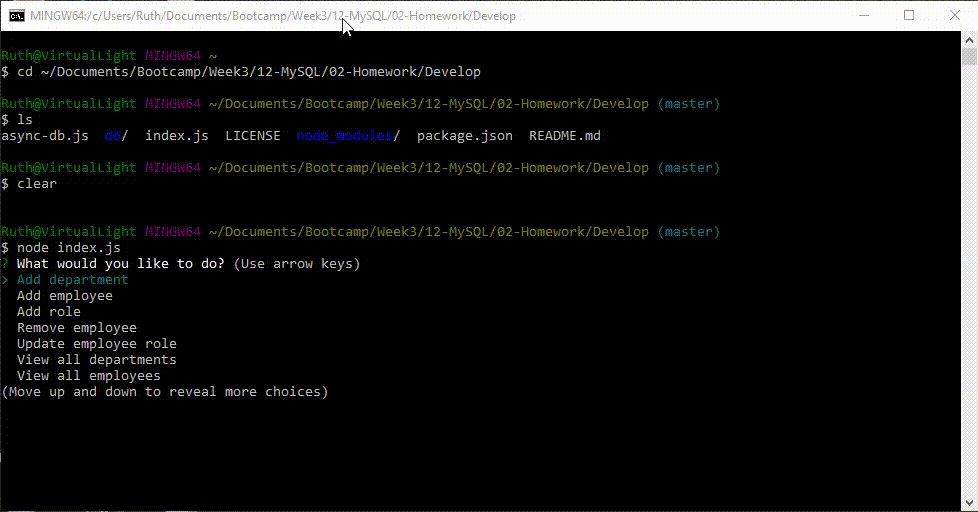

# Employee Tracker (Content Management System)
This command-line application manages a company's employees using node, inquirer, and MySQL.

## Getting Started
You need to set up your MySQL database before you can run the code. 

    1. Download and unzip the code, and install the prerequisites, as explained in the "Installing" section of this README.
    2. In your "employee-tracker-master" directory there is a "db" directory. In that directory there are two files: cms.sql and seed.sql. 
        a. Open your MySQL Workbench and run cms.sql to create the database and tables.
        b. Then run seed.sql to populate the database with some data. (Bonus points if you recognize the people in your database.)
    3. Now that your database is ready to be queried, open index.js and enter your MySQL root password on line 9.
    4. Open a Git terminal. Type "node index.js".

### Prerequisites
  * Git terminal
  * Node
  * MySQL and MySQL Workbench (or the terminal instead of MySQL Workbench)

### Installing
    1. Go to https://github.com/ruthtech/employee-tracker and click on the "Clone or Download" button. 
    2. Choose "Download ZIP". 
    3. Unzip into a directory. If you're on Windows, open File Explorer and navigate to the download directory. Select the ZIP file, right click, and choose "Extract All". Accept the default location.
    4. Once the file is unzipped, navigate to employee-tracker-master.
    5. If you don't have the prerequisites installed, type the following:
       * npm install inquirer
       * npm install mysql
       * npm install console-table
    6. Then use your Git terminal to execute index.js. 

## Running the tests
There is no automated test suite for this command line application. Instead, I ran the following manual tests. 

### Manual tests
    1. "View all employees"
    2. "View all employees by department"
    3. "View all roles"
    4. "View all departments"
    5. "Add department" followed by "View all departments" to confirm that the new department is there.
    6. "Add employee" followed by "View all employees" to confirm that the new employee is there. 
    7. "Add role" followed by "View all roles" to confirm.
    8. "Remove employee" followed by "View all employees" to confirm.
    9. "Update employee role" followed by "View all employees" to confirm.

You can see these tests run by viewing the provided GIF file 
 

## Deployment
To deploy this on a live system, copy all of the files to your computer and follow the instructions in the "Installing" section followed by the "Getting Started" section. This is a command-line tool, not one that runs in the browser. There are no live pages to demonstrate. 

You can see these tests run by viewing the provided animated GIF file 
 

## Built With
* [Visual Studio Code] https://code.visualstudio.com/docs/setup/setup-overview
* [Visual Studio Code Extension "Open in Browser"] 
    * Open VS Code.
    * Open the extensions pane and search for open in browser.
    * Select the version written by TechER and click Install.
* Git Terminal (https://git-scm.com/downloads)
* Node (https://nodejs.org/en/download/)
     * inqiurer
     * mysql
     * console.table
       

## Contributing
This project is not open to contributions.

## Versioning
This project does not use versions at this time. 

## Authors
Ruth Lee

## License
MIT

## Acknowledgments
Thanks to the following:
* U of T Coding Bootcamp (https://bootcamp.learn.utoronto.ca/coding/)
* Eclipse (https://www.eclipse.org/downloads/)
* Node (https://nodejs.org/en/download/)
     * inqiurer
     * mysql
     * console.table
* Git Terminal (https://git-scm.com/downloads)
* Filipe Laborde (https://github.com/codefreeze8) Instructor of the U of T Coding Bootcamp, he wrote the async-db.js file that is checked in here. (I modified it slightly by adding a logging statement to log the SQL query when there was a SQL syntax error.)
* ConvertIO (https://convertio.co/) for converting my MP4 to an animated GIF.

       

